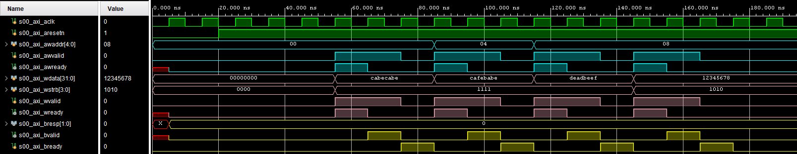
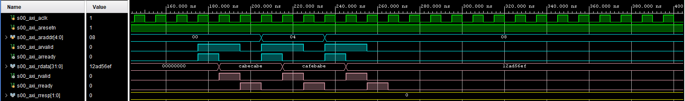
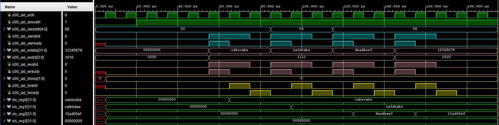
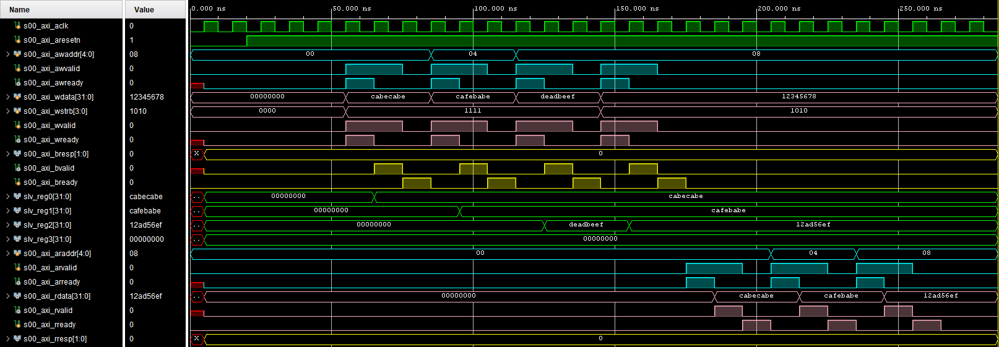

# Dokumentasi Antarmuka AXI Lite

## Gambaran Umum
Antarmuka AXI Lite adalah versi sederhana dari protokol AXI yang dirancang untuk aplikasi kontrol dengan bandwidth rendah dan kompleksitas rendah. Dokumen ini menjelaskan secara detail antarmuka AXI Lite yang digunakan dalam desain ini.

---

## Deskripsi Sinyal

### Kanal Alamat Tulis (AW)
| Nama Sinyal      | Lebar | Arah        | Deskripsi                                              |
|-------------------|-------|-------------|--------------------------------------------------------|
| `awaddr`         | N     | Master → Slave | Alamat tulis yang menunjukkan register atau memori tujuan. |
| `awvalid`        | 1     | Master → Slave | Sinyal valid alamat tulis, diaktifkan saat `awaddr` valid. |
| `awready`        | 1     | Slave → Master | Menunjukkan bahwa slave siap menerima alamat.         |

### Kanal Data Tulis (W)
| Nama Sinyal      | Lebar | Arah        | Deskripsi                                              |
|-------------------|-------|-------------|--------------------------------------------------------|
| `wdata`          | N     | Master → Slave | Data tulis yang dikirim ke alamat tujuan.             |
| `wstrb`          | M     | Master → Slave | Sinyal strobe tulis untuk menunjukkan byte yang valid. |
| `wvalid`         | 1     | Master → Slave | Sinyal valid data tulis, diaktifkan saat `wdata` valid. |
| `wready`         | 1     | Slave → Master | Menunjukkan bahwa slave siap menerima data.           |

### Kanal Respon Tulis (B)
| Nama Sinyal      | Lebar | Arah        | Deskripsi                                              |
|-------------------|-------|-------------|--------------------------------------------------------|
| `bresp`          | 2     | Slave → Master | Respon tulis yang menunjukkan status transaksi tulis. |
| `bvalid`         | 1     | Slave → Master | Sinyal valid respon tulis.                            |
| `bready`         | 1     | Master → Slave | Menunjukkan bahwa master siap menerima respon.        |

### Kanal Alamat Baca (AR)
| Nama Sinyal      | Lebar | Arah        | Deskripsi                                              |
|-------------------|-------|-------------|--------------------------------------------------------|
| `araddr`         | N     | Master → Slave | Alamat baca yang menunjukkan register atau memori tujuan. |
| `arvalid`        | 1     | Master → Slave | Sinyal valid alamat baca, diaktifkan saat `araddr` valid. |
| `arready`        | 1     | Slave → Master | Menunjukkan bahwa slave siap menerima alamat.         |

### Kanal Data Baca (R)
| Nama Sinyal      | Lebar | Arah        | Deskripsi                                              |
|-------------------|-------|-------------|--------------------------------------------------------|
| `rdata`          | N     | Slave → Master | Data baca dari alamat tujuan.                         |
| `rresp`          | 2     | Slave → Master | Respon baca yang menunjukkan status transaksi baca.   |
| `rvalid`         | 1     | Slave → Master | Sinyal valid data baca, diaktifkan saat `rdata` valid. |
| `rready`         | 1     | Master → Slave | Menunjukkan bahwa master siap menerima data.          |

---

## Deskripsi Protokol

### Transaksi Tulis
1. **Fase Alamat**:
   - Master mengaktifkan `awvalid` dengan `awaddr` yang valid.
   - Slave merespon dengan `awready` ketika siap menerima alamat.

2. **Fase Data**:
   - Master mengaktifkan `wvalid` dengan `wdata` dan `wstrb` yang valid.
   - Slave merespon dengan `wready` ketika siap menerima data.

3. **Fase Respon**:
   - Slave mengirimkan respon (`bresp`) bersama dengan `bvalid`.
   - Master mengakui respon dengan mengaktifkan `bready`. 
   
<div align="center">
  
  <p><em>write transaction timing diagram</em></p>
</div>

### Transaksi Baca
1. **Fase Alamat**:
   - Master mengaktifkan `arvalid` dengan `araddr` yang valid.
   - Slave merespon dengan `arready` ketika siap menerima alamat.

2. **Fase Data**:
   - Slave mengaktifkan `rvalid` dengan `rdata` dan `rresp` ketika data tersedia.
   - Master mengaktifkan `rready` untuk menerima data.

<div align="center">
  
  <p><em>read transaction to 4 registers timing diagram</em></p>
</div>
---

## Template program AXI4-LITE
Template program slave AXI4-Lite, contoh ini menggunakan 8 register

### Implementasi logika axi_awready
```verilog
  /**
  * === Implementasi logika axi_awready ===
  * @brief axi_awready diaktifkan selama satu siklus clock S_AXI_ACLK ketika
  * S_AXI_AWVALID dan S_AXI_WVALID keduanya aktif. axi_awready akan 
  * dinonaktifkan kembali saat reset aktif (low).
  */

  always @(posedge S_AXI_ACLK) begin
    if (S_AXI_ARESETN == 1'b0) begin  // Logika reset: Ketika reset aktif (S_AXI_ARESETN = 0)
      axi_awready <= 1'b0;	// Setel axi_awready menjadi tidak aktif (0) karena slave belum siap menerima alamat tulis
      aw_en <= 1'b1;  // Aktifkan aw_en untuk memungkinkan transaksi tulis baru
    end else begin
      if (~axi_awready && S_AXI_AWVALID && S_AXI_WVALID && aw_en) begin // Jika axi_awready tidak aktif tetapi AWVALID, WVALID, dan aw_en aktif
        axi_awready <= 1'b1;  // Aktifkan axi_awready untuk menunjukkan bahwa slave siap menerima alamat tulis
        aw_en <= 1'b0;  // Nonaktifkan aw_en untuk mencegah transaksi baru sebelum transaksi yang sekarang selesai
      end  
      else if (S_AXI_BREADY && axi_bvalid) begin // Jika respons tulis telah diterima oleh master (BREADY = 1 dan bvalid = 1)
        aw_en <= 1'b1;  // Aktifkan kembali aw_en untuk memungkinkan transaksi baru
        axi_awready <= 1'b0; // Nonaktifkan axi_awready karena alamat tulis sebelumnya telah selesai diproses
      end else begin
        axi_awready <= 1'b0;  // Kasus default: pastikan axi_awready tetap tidak aktif
      end
    end
  end
```
### Implementasi latch axi_awready
```verilog
  /**
  * === Implementasi latch S_AXI_AWADDR ===
  * Proses ini digunakan untuk menahan alamat ketika
  * S_AXI_AWVALID dan S_AXI_WVALID keduanya valid.
  */
  always @(posedge S_AXI_ACLK) begin
    if (S_AXI_ARESETN == 1'b0) begin
      axi_awaddr <= 0;
    end else begin
      if (~axi_awready && S_AXI_AWVALID && S_AXI_WVALID && aw_en) begin
        // Latch Alamat Tulis
        axi_awaddr <= S_AXI_AWADDR;
      end
    end
  end
```

### Implementasi latch axi_awready
```verilog
    /**
    * ==== Implementasi logika axi_wready ===
    * axi_wready diaktifkan selama satu siklus clock S_AXI_ACLK ketika
    * S_AXI_AWVALID dan S_AXI_WVALID keduanya aktif.
    * axi_wready akan direset ketika reset dalam kondisi low.
    */
    always @(posedge S_AXI_ACLK) begin
      if (S_AXI_ARESETN == 1'b0) begin
        axi_wready <= 1'b0;
      end else begin
        if (~axi_wready && S_AXI_WVALID && S_AXI_AWVALID && aw_en) begin
        // slave siap menerima data tulis ketika ada alamat tulis dan data tulis yang valid bus alamat dan data tulis.
          axi_wready <= 1'b1;
        end else begin
          axi_wready <= 1'b0;
        end
      end
    end
```
---
### Implementasi penulisan register
```verilog
  /**
  * === Implementasi penulisan register ===
  * Write data diterima dan ditulis ke register yang telah dipetakan ketika
  * axi_wready, S_AXI_WVALID, axi_awready, dan S_AXI_AWVALID aktif
  * Write strobes digunakan untuk memilih byte enable dari register slave saat penulisan
  */
  assign slv_reg_wren = axi_wready && S_AXI_WVALID && axi_awready && S_AXI_AWVALID;

  always @(posedge S_AXI_ACLK) begin
    if (S_AXI_ARESETN == 1'b0) begin
      slv_reg0 <= 0;
      slv_reg1 <= 0;
      slv_reg2 <= 0;
      slv_reg3 <= 0;
      slv_reg4 <= 0;
      slv_reg5 <= 0;
      slv_reg6 <= 0;
    end else begin
      if (slv_reg_wren) begin
        case (axi_awaddr[ADDR_LSB+OPT_MEM_ADDR_BITS:ADDR_LSB])
          3'h0:
          for (
              byte_index = 0;
              byte_index <= (C_S_AXI_DATA_WIDTH / 8) - 1;
              byte_index = byte_index + 1
          )
            if (S_AXI_WSTRB[byte_index] == 1) begin
              // Byte enable yang sesuai diaktifkan sesuai dengan write strobes 
              // Register slave 0
              slv_reg0[(byte_index*8)+:8] <= S_AXI_WDATA[(byte_index*8)+:8];
            end
          3'h1:
          for (
              byte_index = 0;
              byte_index <= (C_S_AXI_DATA_WIDTH / 8) - 1;
              byte_index = byte_index + 1
          )
            if (S_AXI_WSTRB[byte_index] == 1) begin
              // Byte enable yang sesuai diaktifkan sesuai dengan write strobes 
              // Register slave 1
              slv_reg1[(byte_index*8)+:8] <= S_AXI_WDATA[(byte_index*8)+:8];
            end
          3'h2:
          for (
              byte_index = 0;
              byte_index <= (C_S_AXI_DATA_WIDTH / 8) - 1;
              byte_index = byte_index + 1
          )
            if (S_AXI_WSTRB[byte_index] == 1) begin
              // Byte enable yang sesuai diaktifkan sesuai dengan write strobes 
              // Register slave 2
              slv_reg2[(byte_index*8)+:8] <= S_AXI_WDATA[(byte_index*8)+:8];
            end
          3'h3:
          for (
              byte_index = 0;
              byte_index <= (C_S_AXI_DATA_WIDTH / 8) - 1;
              byte_index = byte_index + 1
          )
            if (S_AXI_WSTRB[byte_index] == 1) begin
              // Byte enable yang sesuai diaktifkan sesuai dengan write strobes 
              // Register slave 3
              slv_reg3[(byte_index*8)+:8] <= S_AXI_WDATA[(byte_index*8)+:8];
            end
          3'h4:
          for (
              byte_index = 0;
              byte_index <= (C_S_AXI_DATA_WIDTH / 8) - 1;
              byte_index = byte_index + 1
          )
            if (S_AXI_WSTRB[byte_index] == 1) begin
              // Byte enable yang sesuai diaktifkan sesuai dengan write strobes 
              // Register slave 4
              slv_reg4[(byte_index*8)+:8] <= S_AXI_WDATA[(byte_index*8)+:8];
            end
          3'h5:
          for (
              byte_index = 0;
              byte_index <= (C_S_AXI_DATA_WIDTH / 8) - 1;
              byte_index = byte_index + 1
          )
            if (S_AXI_WSTRB[byte_index] == 1) begin
              // Byte enable yang sesuai diaktifkan sesuai dengan write strobes 
              // Register slave 5
              slv_reg5[(byte_index*8)+:8] <= S_AXI_WDATA[(byte_index*8)+:8];
            end
          3'h6:
          for (
              byte_index = 0;
              byte_index <= (C_S_AXI_DATA_WIDTH / 8) - 1;
              byte_index = byte_index + 1
          )
            if (S_AXI_WSTRB[byte_index] == 1) begin
              // Byte enable yang sesuai diaktifkan sesuai dengan write strobes 
              // Register slave 6
              slv_reg6[(byte_index*8)+:8] <= S_AXI_WDATA[(byte_index*8)+:8];
            end
          default: begin
            slv_reg0 <= slv_reg0;
            slv_reg1 <= slv_reg1;
            slv_reg2 <= slv_reg2;
            slv_reg3 <= slv_reg3;
            slv_reg4 <= slv_reg4;
            slv_reg5 <= slv_reg5;
            slv_reg6 <= slv_reg6;
          end
        endcase
      end
    end
  end
```

### Implementasi respons tulis
```verilog
  /**
  *  === Implementasi logika respons tulis ===
  * Sinyal respons tulis (`axi_bvalid` dan `axi_bresp`) dihasilkan oleh slave
  * ketika sinyal `axi_wready`, `S_AXI_WVALID`, `axi_awready`, dan `S_AXI_AWVALID` semuanya aktif.
  * Ini menunjukkan bahwa alamat dan data telah diterima dan memberikan status dari transaksi tulis.
  */
  always @(posedge S_AXI_ACLK) begin
    if (S_AXI_ARESETN == 1'b0) begin  // Logika reset: ketika reset aktif (S_AXI_ARESETN = 0)
      axi_bvalid <= 0;  // Resetkan `axi_bvalid` ke 0, menandakan tidak ada respons tulis yang valid
      axi_bresp <= 2'b0;  // Resetkan `axi_bresp` ke 0, menandakan respons 'OKAY' (default)
    end else begin
      // Jika semua kondisi berikut terpenuhi:
      // 1. `axi_awready` aktif (alamat tulis diterima oleh slave).
      // 2. `S_AXI_AWVALID` aktif (master mengirimkan alamat tulis yang valid).
      // 3. `axi_bvalid` tidak aktif (belum ada respons tulis saat ini).
      // 4. `axi_wready` aktif (data tulis diterima oleh slave).
      // 5. `S_AXI_WVALID` aktif (master mengirimkan data tulis yang valid).
      if (axi_awready && S_AXI_AWVALID && ~axi_bvalid && axi_wready && S_AXI_WVALID) begin
        axi_bvalid <= 1'b1;  // Slave menghasilkan respons tulis yang valid
        axi_bresp  <= 2'b0;  // Tetapkan `axi_bresp` ke 0 (OKAY) untuk menunjukkan transaksi sukses
        // Catatan: untuk respons error, logika dapat dikembangkan lebih lanjut.
      end else begin
        // Jika master telah menerima respons tulis (`S_AXI_BREADY` aktif)
        // dan `axi_bvalid` aktif, reset `axi_bvalid` ke 0.
        if (S_AXI_BREADY && axi_bvalid) begin
          // Master siap menerima respons tulis, nonaktifkan `axi_bvalid`.
          axi_bvalid <= 1'b0;
        end
      end
    end
  end   
```

<div align="center">
  
  <p><em>write transaction to 4 registers timing diagram</em></p>
</div>

<div align="center">
  
  <p><em>read transaction to 4 registers timing diagram</em></p>
</div>


---
### axi_lite

