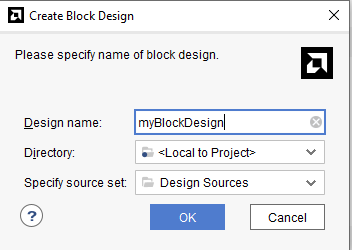
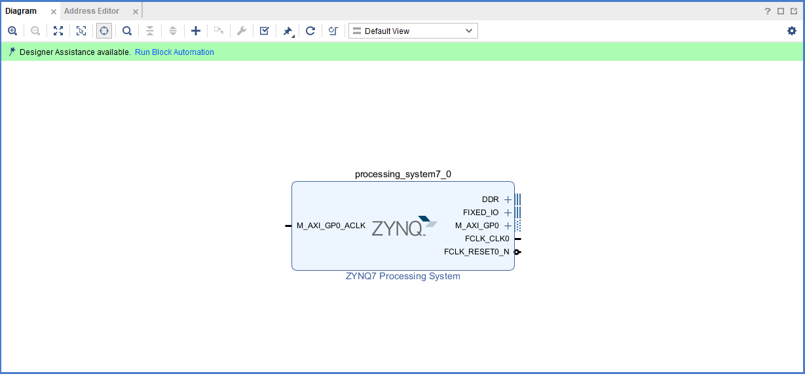
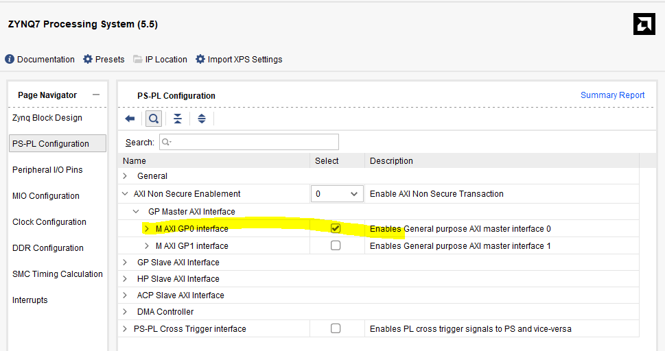
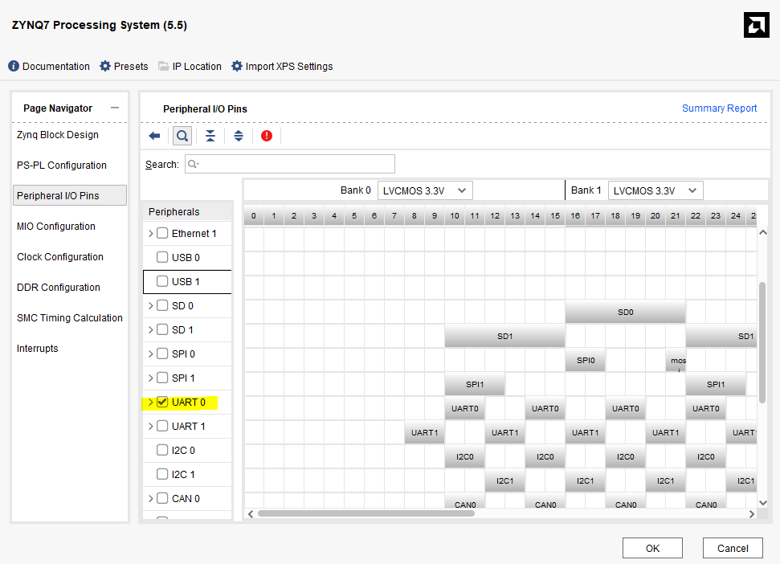
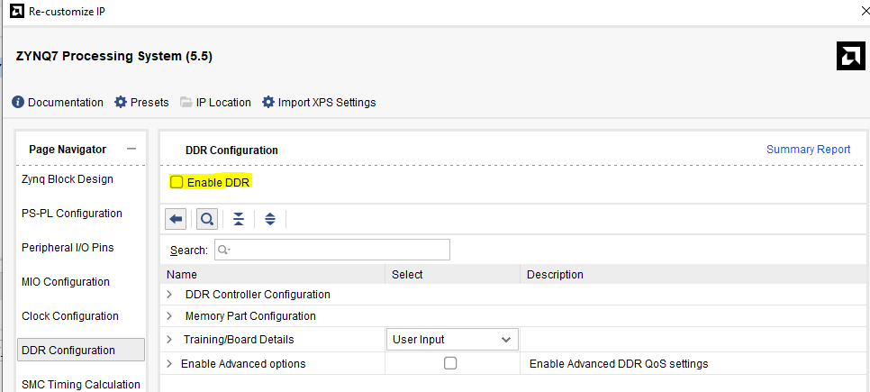

# AXI LITE REGISTER LOOPBACK TEST
1. Buat project baru (sesuaikan chip FPGA)
2. Buat block design
    <div align="center">
      
      <p><em>new block project</em></p>
    </div>
3. Tambahkan IP Core `ZYNQ7 Processing System`
    <div align="center">
      
      <p><em>Block Design</em></p>
    </div>
4. Pastikan M AXI GP0 interface tercentang
    <div align="center">
      
      <p><em>M AXI GP0 Interface Checked</em></p>
    </div>
5. Aktifkan PS UART untuk debugging
    <div align="center">
      
      <p><em>PS UART Checked</em></p>
    </div>
6. Disini saya tidak menggunakan DDR dulu
    <div align="center">
      
      <p><em>PS UART Checked</em></p>
    </div>
7. Buatkan design source baru untuk file `axi_lite_slave.v`
ini adalah program hasil generetan dari vivado. namun sedikit saja improve agar mudah dipahami, bisa langsung dicopy, ini ada 7 register yang dapat digunakan.
```verilog
module axi_lite_slave #(
    // Lebar bus data S_AXI
    parameter integer C_S_AXI_DATA_WIDTH = 32,
    // Lebar bus alamat S_AXI
    parameter integer C_S_AXI_ADDR_WIDTH = 5
) (
    // User ports ends

    input wire S_AXI_ACLK,     // Sinyal Clock Global
    input wire S_AXI_ARESETN, // Sinyal Reset Global. Sinyal ini Aktif LOW
    
    input wire [C_S_AXI_ADDR_WIDTH-1 : 0] S_AXI_AWADDR,  // Alamat penulisan (dikirim oleh master, diterima oleh slave)
    input wire S_AXI_AWVALID, // Valid alamat penulisan. Sinyal ini menunjukkan bahwa master memberikan alamat penulisan yang valid dan informasi kontrol terkait.
    output wire S_AXI_AWREADY, // Siap menerima alamat penulisan. Sinyal ini menunjukkan bahwa slave siap menerima alamat dan sinyal kontrol terkait.
   
    input wire [C_S_AXI_DATA_WIDTH-1 : 0] S_AXI_WDATA,  // Data penulisan (dikirim oleh master, diterima oleh slave)   
    input wire [(C_S_AXI_DATA_WIDTH/8)-1 : 0] S_AXI_WSTRB, // Strobe penulisan. Sinyal ini menunjukkan byte mana yang memuat data valid. Ada satu bit strobe untuk setiap 8 bit pada bus data penulisan.
    input wire S_AXI_WVALID,   // Valid penulisan. Sinyal ini menunjukkan bahwa data penulisan valid dan strobe tersedia.
    output wire S_AXI_WREADY,     // Siap menerima data penulisan. Sinyal ini menunjukkan bahwa slave dapat menerima data penulisan.
    
    output wire [1 : 0] S_AXI_BRESP, // Respons penulisan. Sinyal ini menunjukkan status transaksi penulisan.
    output wire S_AXI_BVALID, // Valid respons penulisan. Sinyal ini menunjukkan bahwa saluran memberikan respons penulisan yang valid.
    input wire S_AXI_BREADY, // Siap menerima respons. Sinyal ini menunjukkan bahwa master dapat menerima respons penulisan.
    
    input wire [C_S_AXI_ADDR_WIDTH-1 : 0] S_AXI_ARADDR, // Alamat pembacaan (dikirim oleh master, diterima oleh slave)
    input wire S_AXI_ARVALID, // Valid alamat pembacaan. Sinyal ini menunjukkan bahwa saluran memberikan alamat pembacaan yang valid dan informasi kontrol terkait.
    output wire S_AXI_ARREADY, // Siap menerima alamat pembacaan. Sinyal ini menunjukkan bahwa slave siap menerima alamat dan sinyal kontrol terkait.
    
    output wire [C_S_AXI_DATA_WIDTH-1 : 0] S_AXI_RDATA, // Data pembacaan (dikirim oleh slave)
    output wire [1 : 0] S_AXI_RRESP, // Respons pembacaan. Sinyal ini menunjukkan status transfer pembacaan.
    output wire S_AXI_RVALID, // Valid pembacaan. Sinyal ini menunjukkan bahwa saluran memberikan data pembacaan yang diperlukan.
    input wire S_AXI_RREADY, // Siap menerima data pembacaan. Sinyal ini menunjukkan bahwa master dapat menerima data pembacaan dan informasi respons.

    output wire [C_S_AXI_DATA_WIDTH-1:0] s_slv_reg0, // Register slave 0
    output wire [C_S_AXI_DATA_WIDTH-1:0] s_slv_reg1, // Register slave 1
    output wire [C_S_AXI_DATA_WIDTH-1:0] s_slv_reg2, // Register slave 2
    output wire [C_S_AXI_DATA_WIDTH-1:0] s_slv_reg3, // Register slave 3
    output wire [C_S_AXI_DATA_WIDTH-1:0] s_slv_reg4, // Register slave 4
    output wire [C_S_AXI_DATA_WIDTH-1:0] s_slv_reg5, // Register slave 5
    output wire [C_S_AXI_DATA_WIDTH-1:0] s_slv_reg6  // Register slave 6
);

    // Sinyal AXI4LITE
    reg [C_S_AXI_ADDR_WIDTH-1 : 0] axi_awaddr; // Alamat penulisan AXI
    reg axi_awready; // Indikator siap menerima alamat penulisan
    reg axi_wready; // Indikator siap menerima data penulisan
    reg [1 : 0] axi_bresp; // Respons penulisan
    reg axi_bvalid; // Validitas respons penulisan
    reg [C_S_AXI_ADDR_WIDTH-1 : 0] axi_araddr; // Alamat pembacaan AXI
    reg axi_arready; // Indikator siap menerima alamat pembacaan
    reg [C_S_AXI_DATA_WIDTH-1 : 0] axi_rdata; // Data pembacaan AXI
    reg [1 : 0] axi_rresp; // Respons pembacaan
    reg axi_rvalid; // Validitas data pembacaan

    // Sinyal support
    wire slv_reg_rden; // Indikator pembacaan register slave
    wire slv_reg_wren; // Indikator penulisan register slave
    reg [C_S_AXI_DATA_WIDTH-1:0] reg_data_out; // Data output register
    integer byte_index; // Indeks byte
    reg aw_en; // Indikator enable untuk penulisan alamat

    // Sinyal desain khusus contoh
    // Parameter lokal untuk pengalamatan register/memori 32 bit / 64 bit
    // ADDR_LSB digunakan untuk pengalamatan register/memori 32/64 bit
    // ADDR_LSB = 2 untuk register 32 bit (n hingga 2)
    // ADDR_LSB = 3 untuk register 64 bit (n hingga 3)
    localparam integer ADDR_LSB = (C_S_AXI_DATA_WIDTH / 32) + 1;
    localparam integer OPT_MEM_ADDR_BITS = 2; // Bit pengalamatan memori tambahan

    //-- Number of Slave Registers 7
    reg [C_S_AXI_DATA_WIDTH-1:0] slv_reg0;
    reg [C_S_AXI_DATA_WIDTH-1:0] slv_reg1;
    reg [C_S_AXI_DATA_WIDTH-1:0] slv_reg2;
    reg [C_S_AXI_DATA_WIDTH-1:0] slv_reg3;
    reg [C_S_AXI_DATA_WIDTH-1:0] slv_reg4;
    reg [C_S_AXI_DATA_WIDTH-1:0] slv_reg5;
    reg [C_S_AXI_DATA_WIDTH-1:0] slv_reg6;

    // I/O Connections assignments
    assign S_AXI_AWREADY = axi_awready;
    assign S_AXI_WREADY  = axi_wready;
    assign S_AXI_BRESP   = axi_bresp;
    assign S_AXI_BVALID  = axi_bvalid;
    assign S_AXI_ARREADY = axi_arready;
    assign S_AXI_RDATA   = axi_rdata;
    assign S_AXI_RRESP   = axi_rresp;
    assign S_AXI_RVALID  = axi_rvalid;

    assign s_slv_reg0 = slv_reg0;
    assign s_slv_reg1 = slv_reg1;
    assign s_slv_reg2 = slv_reg2;
    assign s_slv_reg3 = slv_reg3;
    assign s_slv_reg4 = slv_reg4;
    assign s_slv_reg5 = slv_reg5;
    assign s_slv_reg6 = slv_reg6;

    /**
    * === Implementasi logika axi_awready ===
    * @brief axi_awready diaktifkan selama satu siklus clock S_AXI_ACLK ketika
    * S_AXI_AWVALID dan S_AXI_WVALID keduanya aktif. axi_awready akan 
    * dinonaktifkan kembali saat reset aktif (low).
    */

    always @(posedge S_AXI_ACLK) begin
      if (S_AXI_ARESETN == 1'b0) begin  // Logika reset: Ketika reset aktif (S_AXI_ARESETN = 0)
        axi_awready <= 1'b0;	// Setel axi_awready menjadi tidak aktif (0) karena slave belum siap menerima alamat tulis
        aw_en <= 1'b1;  // Aktifkan aw_en untuk memungkinkan transaksi tulis baru
      end else begin
        if (~axi_awready && S_AXI_AWVALID && S_AXI_WVALID && aw_en) begin // Jika axi_awready tidak aktif tetapi AWVALID, WVALID, dan aw_en aktif
          axi_awready <= 1'b1;  // Aktifkan axi_awready untuk menunjukkan bahwa slave siap menerima alamat tulis
          aw_en <= 1'b0;  // Nonaktifkan aw_en untuk mencegah transaksi baru sebelum transaksi yang sekarang selesai
        end  
        else if (S_AXI_BREADY && axi_bvalid) begin // Jika respons tulis telah diterima oleh master (BREADY = 1 dan bvalid = 1)
          aw_en <= 1'b1;  // Aktifkan kembali aw_en untuk memungkinkan transaksi baru
          axi_awready <= 1'b0; // Nonaktifkan axi_awready karena alamat tulis sebelumnya telah selesai diproses
        end else begin
          axi_awready <= 1'b0;  // Kasus default: pastikan axi_awready tetap tidak aktif
        end
      end
    end

    /**
    * === Implementasi latch S_AXI_AWADDR ===
    * Proses ini digunakan untuk menahan alamat ketika
    * S_AXI_AWVALID dan S_AXI_WVALID keduanya valid.
    */
    always @(posedge S_AXI_ACLK) begin
      if (S_AXI_ARESETN == 1'b0) begin
        axi_awaddr <= 0;
      end else begin
        if (~axi_awready && S_AXI_AWVALID && S_AXI_WVALID && aw_en) begin
          // Latch Alamat Tulis
          axi_awaddr <= S_AXI_AWADDR;
        end
      end
    end

    /**
    * ==== Implementasi logika axi_wready ===
    * axi_wready diaktifkan selama satu siklus clock S_AXI_ACLK ketika
    * S_AXI_AWVALID dan S_AXI_WVALID keduanya aktif.
    * axi_wready akan direset ketika reset dalam kondisi low.
    */
    always @(posedge S_AXI_ACLK) begin
      if (S_AXI_ARESETN == 1'b0) begin
        axi_wready <= 1'b0;
      end else begin
        if (~axi_wready && S_AXI_WVALID && S_AXI_AWVALID && aw_en) begin
        // slave siap menerima data tulis ketika ada alamat tulis dan data tulis yang valid bus alamat dan data tulis.
          axi_wready <= 1'b1;
        end else begin
          axi_wready <= 1'b0;
        end
      end
    end

    /**
    * === Implementasi penulisan register ===
    * Write data diterima dan ditulis ke register yang telah dipetakan ketika
    * axi_wready, S_AXI_WVALID, axi_awready, dan S_AXI_AWVALID aktif
    * Write strobes digunakan untuk memilih byte enable dari register slave saat penulisan
    */
    assign slv_reg_wren = axi_wready && S_AXI_WVALID && axi_awready && S_AXI_AWVALID;

    always @(posedge S_AXI_ACLK) begin
      if (S_AXI_ARESETN == 1'b0) begin
        slv_reg0 <= 0;
        slv_reg1 <= 0;
        slv_reg2 <= 0;
        slv_reg3 <= 0;
        slv_reg4 <= 0;
        slv_reg5 <= 0;
        slv_reg6 <= 0;
      end else begin
        if (slv_reg_wren) begin
          case (axi_awaddr[ADDR_LSB+OPT_MEM_ADDR_BITS:ADDR_LSB])
            3'h0:
            for (
                byte_index = 0;
                byte_index <= (C_S_AXI_DATA_WIDTH / 8) - 1;
                byte_index = byte_index + 1
            )
              if (S_AXI_WSTRB[byte_index] == 1) begin
                // Byte enable yang sesuai diaktifkan sesuai dengan write strobes 
                // Register slave 0
                slv_reg0[(byte_index*8)+:8] <= S_AXI_WDATA[(byte_index*8)+:8];
              end
            3'h1:
            for (
                byte_index = 0;
                byte_index <= (C_S_AXI_DATA_WIDTH / 8) - 1;
                byte_index = byte_index + 1
            )
              if (S_AXI_WSTRB[byte_index] == 1) begin
                // Byte enable yang sesuai diaktifkan sesuai dengan write strobes 
                // Register slave 1
                slv_reg1[(byte_index*8)+:8] <= S_AXI_WDATA[(byte_index*8)+:8];
              end
            3'h2:
            for (
                byte_index = 0;
                byte_index <= (C_S_AXI_DATA_WIDTH / 8) - 1;
                byte_index = byte_index + 1
            )
              if (S_AXI_WSTRB[byte_index] == 1) begin
                // Byte enable yang sesuai diaktifkan sesuai dengan write strobes 
                // Register slave 2
                slv_reg2[(byte_index*8)+:8] <= S_AXI_WDATA[(byte_index*8)+:8];
              end
            3'h3:
            for (
                byte_index = 0;
                byte_index <= (C_S_AXI_DATA_WIDTH / 8) - 1;
                byte_index = byte_index + 1
            )
              if (S_AXI_WSTRB[byte_index] == 1) begin
                // Byte enable yang sesuai diaktifkan sesuai dengan write strobes 
                // Register slave 3
                slv_reg3[(byte_index*8)+:8] <= S_AXI_WDATA[(byte_index*8)+:8];
              end
            3'h4:
            for (
                byte_index = 0;
                byte_index <= (C_S_AXI_DATA_WIDTH / 8) - 1;
                byte_index = byte_index + 1
            )
              if (S_AXI_WSTRB[byte_index] == 1) begin
                // Byte enable yang sesuai diaktifkan sesuai dengan write strobes 
                // Register slave 4
                slv_reg4[(byte_index*8)+:8] <= S_AXI_WDATA[(byte_index*8)+:8];
              end
            3'h5:
            for (
                byte_index = 0;
                byte_index <= (C_S_AXI_DATA_WIDTH / 8) - 1;
                byte_index = byte_index + 1
            )
              if (S_AXI_WSTRB[byte_index] == 1) begin
                // Byte enable yang sesuai diaktifkan sesuai dengan write strobes 
                // Register slave 5
                slv_reg5[(byte_index*8)+:8] <= S_AXI_WDATA[(byte_index*8)+:8];
              end
            3'h6:
            for (
                byte_index = 0;
                byte_index <= (C_S_AXI_DATA_WIDTH / 8) - 1;
                byte_index = byte_index + 1
            )
              if (S_AXI_WSTRB[byte_index] == 1) begin
                // Byte enable yang sesuai diaktifkan sesuai dengan write strobes 
                // Register slave 6
                slv_reg6[(byte_index*8)+:8] <= S_AXI_WDATA[(byte_index*8)+:8];
              end
            default: begin
              slv_reg0 <= slv_reg0;
              slv_reg1 <= slv_reg1;
              slv_reg2 <= slv_reg2;
              slv_reg3 <= slv_reg3;
              slv_reg4 <= slv_reg4;
              slv_reg5 <= slv_reg5;
              slv_reg6 <= slv_reg6;
            end
          endcase
        end
      end
    end

    /**
    *  Implementasi logika respons tulis
    * Sinyal respons tulis (`axi_bvalid` dan `axi_bresp`) dihasilkan oleh slave
    * ketika sinyal `axi_wready`, `S_AXI_WVALID`, `axi_awready`, dan `S_AXI_AWVALID` semuanya aktif.
    * Ini menunjukkan bahwa alamat dan data telah diterima dan memberikan status dari transaksi tulis.
    */
    always @(posedge S_AXI_ACLK) begin
      if (S_AXI_ARESETN == 1'b0) begin  // Logika reset: ketika reset aktif (S_AXI_ARESETN = 0)
        axi_bvalid <= 0;  // Resetkan `axi_bvalid` ke 0, menandakan tidak ada respons tulis yang valid
        axi_bresp <= 2'b0;  // Resetkan `axi_bresp` ke 0, menandakan respons 'OKAY' (default)
      end else begin
        // Jika semua kondisi berikut terpenuhi:
        // 1. `axi_awready` aktif (alamat tulis diterima oleh slave).
        // 2. `S_AXI_AWVALID` aktif (master mengirimkan alamat tulis yang valid).
        // 3. `axi_bvalid` tidak aktif (belum ada respons tulis saat ini).
        // 4. `axi_wready` aktif (data tulis diterima oleh slave).
        // 5. `S_AXI_WVALID` aktif (master mengirimkan data tulis yang valid).
        if (axi_awready && S_AXI_AWVALID && ~axi_bvalid && axi_wready && S_AXI_WVALID) begin
          axi_bvalid <= 1'b1;  // Slave menghasilkan respons tulis yang valid
          axi_bresp  <= 2'b0;  // Tetapkan `axi_bresp` ke 0 (OKAY) untuk menunjukkan transaksi sukses
          // Catatan: untuk respons error, logika dapat dikembangkan lebih lanjut.
        end else begin
          // Jika master telah menerima respons tulis (`S_AXI_BREADY` aktif)
          // dan `axi_bvalid` aktif, reset `axi_bvalid` ke 0.
          if (S_AXI_BREADY && axi_bvalid) begin
            // Master siap menerima respons tulis, nonaktifkan `axi_bvalid`.
            axi_bvalid <= 1'b0;
          end
        end
      end
    end   

endmodule

```

8. Mari kita coba simulasikan dukuy program tersebut dengan testbench berikut. ini adalah program testbench yang bertindak sebagai master axi lite.
```verilog
```